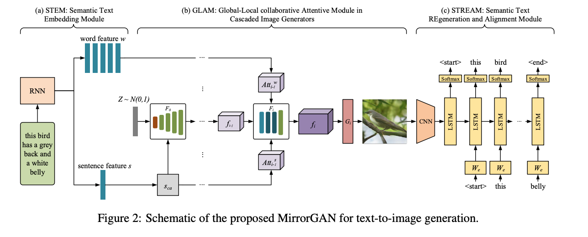
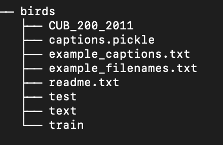

# MirrorGAN [Keras]

[Paper: MirrorGAN: Learning Text-to-image Generation by Redescription](https://arxiv.org/abs/1903.05854)

Kerasで実装してみました。公式の実装ではありませんので注意してください。

Attention because it is not official

## Dependencies
- python 3.6.8
- keras 2.2.4 
- tensorflow 1.12.0

Other
- easydict
- pandas
- tqdm

## Using
- cloneします

  `$ git clone git@github.com:komiya-m/MirrorGAN.git`

  `$ cd MirrorGAN`

- データをダウンロードしてください

[AttnGAN ](https://github.com/taoxugit/AttnGAN) こちらのDataの欄を参考にbirdsの前処理されたメタデータとデータセットをダウンロードしてください。

ディレクトリ構造参考

- まずはSTREAM部分をpretraningすることをおすすめします。

　config.pyで設定が変更できます。TREE.BRANCH_NUM = 3 にしてください。その後下記を実行。
  
  `$ python pretrain_STREAM.py `

- GANのトレーニング。TREE.BRANCH_NUM = 1から始めてください。

  `$ python train.py `

## Reference
- [MirrorGAN: Learning Text-to-image Generation by Redescription](https://arxiv.org/abs/1903.05854)
- [StackGAN++: Realistic Image Synthesis with Stacked Generative Adversarial Networks](https://arxiv.org/abs/1710.10916)
- [AttnGAN: Fine-Grained Text to Image Generation with Attentional Generative Adversarial Networks](https://arxiv.org/abs/1711.10485)

## Date
2019/4/28